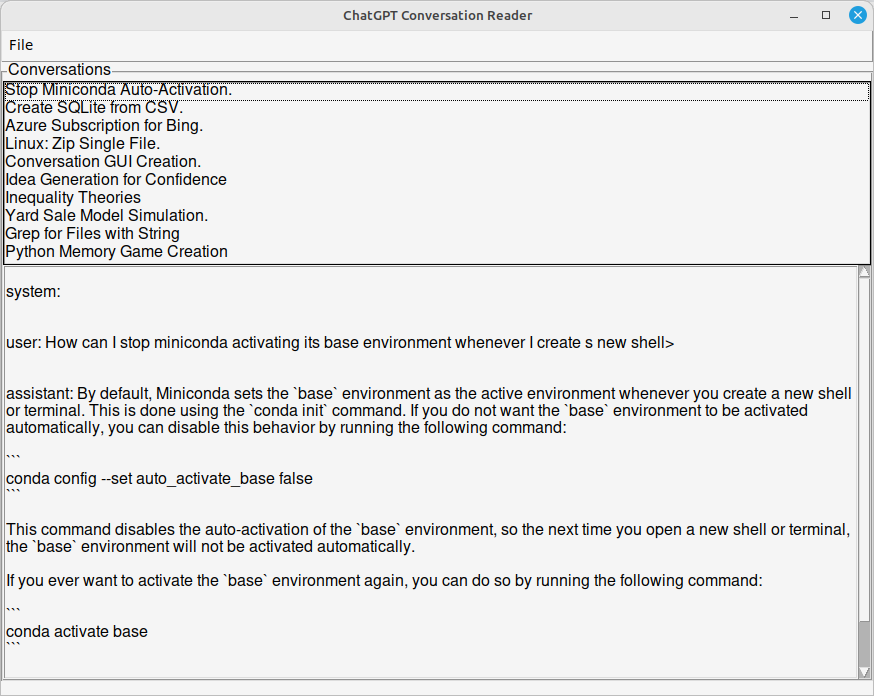
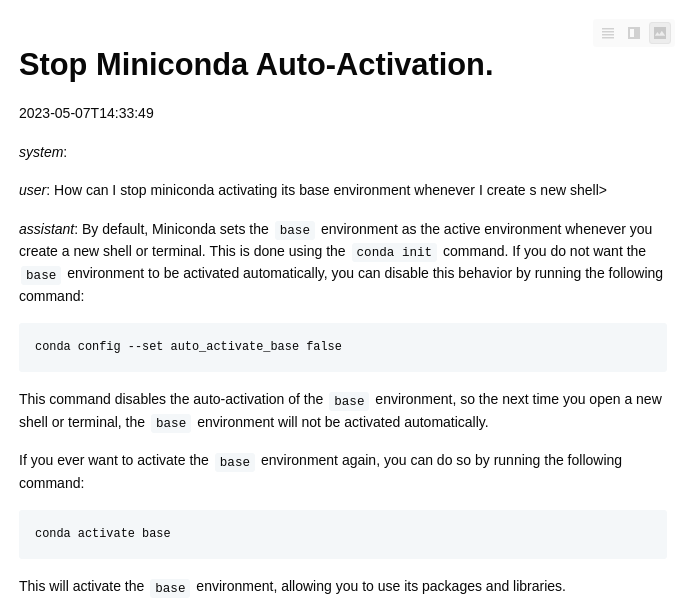

# ChatGPT Convo Reader

The reader lets you find, view and format the conversations you've had with ChatGPT in the playground.

It does so by reading the zip file that ChatGPT saves when you ask it to dump your data.

**Please note:** this is an independently developed project, and it has no official connection with ChatGPT or OpenAI.

It will read, list and display the conversations from a ChatGPT dump file:



You can use it to save a conversation as a nicely formatted Markdown document.

_Here's one I prepared earlier._



## Installation

run `pip install gpt-convo-reader`

## Usage

1. In the directory from which you wish to run the reader, create a file `convert.ini` file with the following format:

   ```text
   [default directory locations]
   zip directory = foo
   save directory = bar
   ```
   
   where `foo` is the relative path to the directory in which the dumped zip file is located, and `bar`
   is the default directory into which you will save markdown files.
1. In your chosen directory, run `gpt_reader_gui`
2. From the `File\Open` menu, open the dumped zip file you want to examine. A list of title will be displayed.
3. Select a conversation you want to examine from the list of titles.
4. If you want to export a conversation as a neatly formatted markdown file, you can do so from the `File\Save` menu.

## How to contribute

Please raise any issues (bugs or feature requests) on GitHub.

## Contact details

I'm Romilly Cocking: @RAREblog on twitter, @romilly@fosstodon.org


