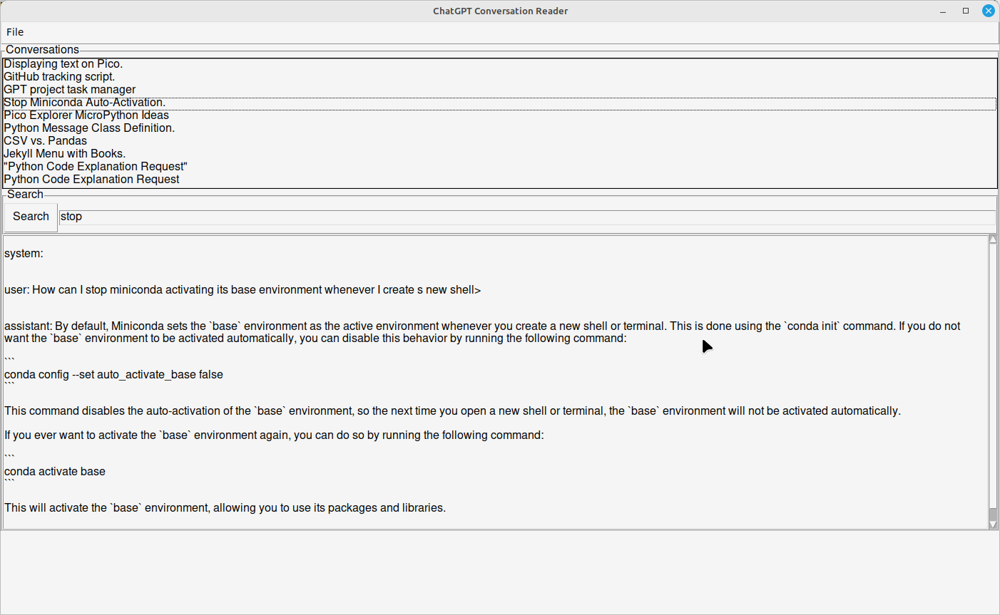

# ChatGPT Convo Reader

The reader lets you find, view and format the conversations you've had with ChatGPT in the playground.

It does so by reading the zip file that ChatGPT saves when you ask it to dump your data.

**Please note:** this is an independently developed project, and it ha no official connection with ChatGPT or OpenAI.

It will read, list and display the conversations from a ChatGPT dump file:

You can use it to save a conversation as a nicely formatted Markdown document:

## Installation

1. Clone this repository into a directory of your choice.
2. Run `pip install -r requirements.txt`
3. If necessary, edit the `convert.ini` file to specify the default directory to search for the dumped zip file and the
   default directory in which to save exported markdown files.

## Usage

1. In the `src/converter` directory, run `python3 gui.py`
2. From the file menu, open the dumped zip file you want to examine.
3. Select the conversation you want to examine from the list of titles.
4. If you want to export a conversation as a neatly formatted markdown file, you can do so from the `File\Save` menu.

## How to contribute

Please raise any issues (bugs or feature requests) on GitHub.

## Contact details

I'm Romilly Cocking:
   @RAREblog on twitter
   @romilly@fosstodon.org
   romilly.cocking on skype

